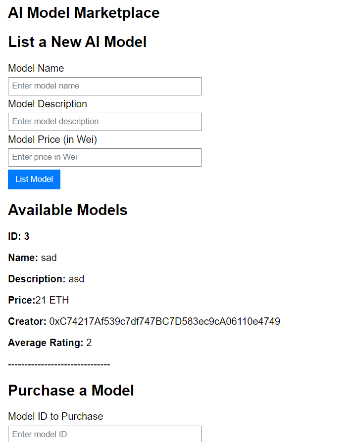
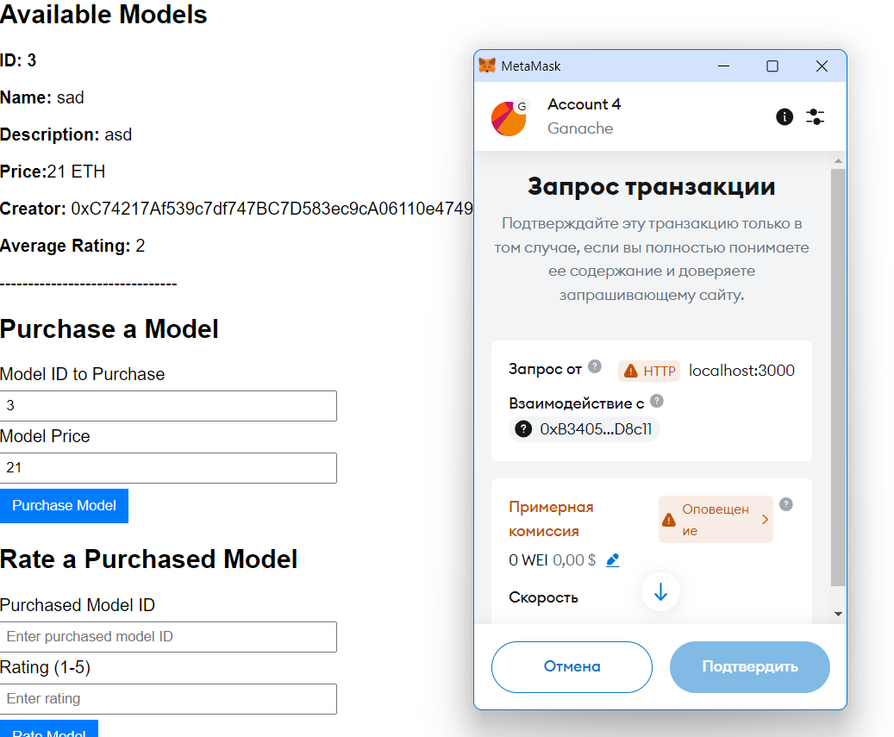

# AI Model Marketplace dApp
This is a decentralized application that allows users to list, purchase, and rate AI models.

## Usage
1. Install dependencies: `npm install`.
2. Compile the contract: `truffle compile`.
3. Deploy to Ganache: `truffle migrate`.
4. Start the frontend: `npm start`.

## Screenshots

